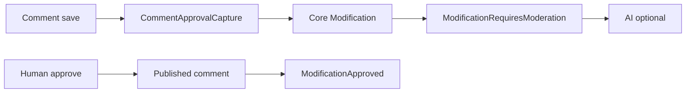

# CMS Module

Content management: entities, presets, contents, categories, comments, media, and related Filament resources.

## Documentation

| Topic | Document |
|-------|----------|
| **Comment moderation** (capture, context builder, approval flow) | [docs/COMMENT_MODERATION.md](docs/COMMENT_MODERATION.md) |
| **Cross-module event bus** (moderation + search indexing overview) | [Modules/Core/docs/EVENT_ORCHESTRATION.md](../Core/docs/EVENT_ORCHESTRATION.md) |
| **AI moderation** (listener, job, config) | [Modules/AI/docs/MODERATION.md](../AI/docs/MODERATION.md) |
| **CMS graph provider** (content graph defaults and edge labels) | [Modules/Core/docs/GRAPH_SYSTEM.md](../Core/docs/GRAPH_SYSTEM.md) |
| **Bulk imports** (`cms:import`, external plugins, dry-run boundary) | [docs/IMPORTS.md](docs/IMPORTS.md) |

## Comment moderation (summary)



CMS registers `CommentModerationContextBuilder` on Core’s `ModerationContextBuilderRegistry`; AI resolves it at runtime without importing CMS classes.

## Bulk imports

CMS exposes the module-owned `cms:import` command while Core supplies its common command mechanics. The command accepts only importers implementing the CMS marker contract, so selecting the command also fixes the destination domain. Source access and mapping remain in external plugins; CMS retains its content DTOs, pipeline, upserters, and post-processing.

See [docs/IMPORTS.md](docs/IMPORTS.md) for options, Naxos examples, dry-run guarantees, and extension rules.

## Search indexing

CMS content search indexes relation data for contributors, categories, tags, and locations. Public filters may use the schema-declared dot paths exposed by Core search, for example `tags.id`, `categories.slug`, or `locations.country`.

These filters target indexed relation fields, not arbitrary Eloquent traversal. Core translates them to Elasticsearch nested queries, Typesense nested-field filters, or database `whereHas` / `whereDoesntHave` depending on the active search driver.

## Graph provider

CMS registers `Modules\CMS\Graph\CmsGraphProvider` as a Core Graph provider. Core still owns graph routes, traversal, authorization, request validation, and response shape. CMS only contributes content-oriented defaults: `contents` expand to `tags`, `categories`, `contributors`, and `locations` when no `relations[]` are requested; summary fields prefer editorial identifiers such as title, slug, path, status, type, and timestamps; edge labels map CMS relations to names such as `tagged_as`, `categorized_as`, `contributed_by`, and `located_at`.

Graph relation loading follows Core rules: explicit `relations[]` win, provider defaults apply only when relations are omitted, and excluded CMS implementation relations such as translations, history, modifications, locks, and media are not graph-traversable.

## Graph runtime benchmark

CMS includes an opt-in benchmark for Core Graph runtime traversal over realistic content relations. The benchmark is intentionally outside the normal PHPUnit suites and is skipped unless explicitly enabled. Run it when changing Core Graph traversal/search behavior, CMS graph provider defaults, or before deciding whether Phase 5 materialized edges are justified.

```bash
CMS_GRAPH_BENCHMARK_ENABLED=true rtk php artisan test --compact Modules/CMS/tests/Benchmark/CmsGraphRuntimeBenchmarkTest.php
```

Environment variables:

| Variable | Default | Purpose |
| --- | ---: | --- |
| `CMS_GRAPH_BENCHMARK_ENABLED` | `false` | Enables the opt-in benchmark. |
| `CMS_GRAPH_BENCHMARK_CONTENTS` | `250` | Number of content records generated. |
| `CMS_GRAPH_BENCHMARK_TAGS` | `80` | Number of tags shared across contents. |
| `CMS_GRAPH_BENCHMARK_CATEGORIES` | `40` | Number of categories shared across contents. |
| `CMS_GRAPH_BENCHMARK_CONTRIBUTORS` | `40` | Number of contributors shared across contents. |
| `CMS_GRAPH_BENCHMARK_LOCATIONS` | `40` | Number of locations shared across contents. |
| `CMS_GRAPH_BENCHMARK_ITERATIONS` | `5` | Iterations per benchmark scenario. |

The benchmark reports per-scenario duration, query count, peak memory, node count, edge count, truncation, and ACL filtering. Treat it as performance evidence, not as a normal pass/fail feature test.
