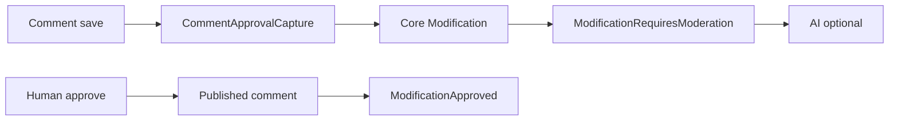

# CMS Module

Content management: entities, presets, contents, categories, comments, media, and related Filament resources.

## Documentation

| Topic | Document |
|-------|----------|
| **Comment moderation** (capture, context builder, approval flow) | [docs/COMMENT_MODERATION.md](docs/COMMENT_MODERATION.md) |
| **Cross-module event bus** (moderation + search indexing overview) | [Modules/Core/docs/EVENT_ORCHESTRATION.md](../Core/docs/EVENT_ORCHESTRATION.md) |
| **AI moderation** (listener, job, config) | [Modules/AI/docs/MODERATION.md](../AI/docs/MODERATION.md) |

## Comment moderation (summary)

CMS registers `CommentModerationContextBuilder` on Core’s `ModerationContextBuilderRegistry`; AI resolves it at runtime without importing CMS classes.

## Search indexing

CMS content search indexes relation data for contributors, categories, tags, and locations. Public filters may use the schema-declared dot paths exposed by Core search, for example `tags.id`, `categories.slug`, or `locations.country`.

These filters target indexed relation fields, not arbitrary Eloquent traversal. Core translates them to Elasticsearch nested queries, Typesense nested-field filters, or database `whereHas` / `whereDoesntHave` depending on the active search driver.
