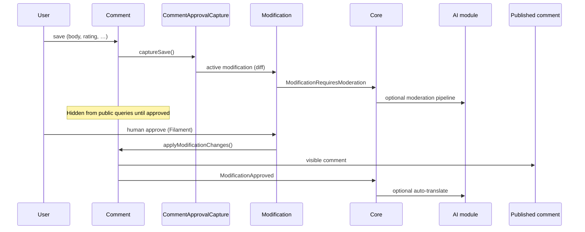

# CMS comment moderation

CMS owns the **comment domain**: capture, diff enrichment, publication after approval, and the **moderation context adapter** for AI.

Orchestration (events, registry, fallback) is documented in [Modules/Core/docs/EVENT_ORCHESTRATION.md](../../Core/docs/EVENT_ORCHESTRATION.md).

AI behaviour (listener, job, thresholds) is in [Modules/AI/docs/MODERATION.md](../../AI/docs/MODERATION.md).

---

## Responsibilities

| Concern | Owner | Class / artifact |
|---------|--------|------------------|
| Pending comment save | CMS | `Comment` + `CommentApprovalCapture` |
| Modification diff | CMS | `CommentApprovalCapture::enrichDiff()` |
| Emit moderation need | **Core** | `ModificationRequiresModeration` on modification create |
| LLM context (article + body) | CMS | `CommentModerationContextBuilder` |
| AI analysis + vote | AI | `ApproveModificationJob` (via registry) |
| Publish approved comment | CMS | `Comment::applyModificationChanges()` |
| Post-approve hooks | Core + AI | `ModificationApproved` → optional `TranslateModelJob` |

CMS **does not** reference `config('ai.*')` or AI jobs.

---

## End-to-end flow



---

## CommentApprovalCapture

**Path:** `app/Services/CommentApprovalCapture.php`

Builds the approval diff:

- `body` / `locale` from pending translations
- `content_id`
- optional `rating_score`

Creates or reuses an active `Modification` with `approvers_required = 1`.

Does **not** dispatch events directly — Core emits `ModificationRequiresModeration` when the modification is first saved.

---

## Moderation context builder (CMS → Core registry)

**Path:** `app/Services/CommentModerationContextBuilder.php`

Implements `Modules\Core\Contracts\ModerationContextBuilder`:

```php
public function supports(Modification $modification): bool
{
    return $modification->modifiable_type === Comment::class;
}

public function build(Modification $modification): ModerationContext
{
    // Reads content_id, body, locale from modification JSON
    // Loads Content (+ excerpt) for LLM context
}
```

Registered in `CMSServiceProvider::boot()`:

```php
$this->app->make(ModerationContextBuilderRegistry::class)
    ->register($this->app->make(CommentModerationContextBuilder::class));
```

---

## After approval

`Comment::applyModificationChanges()`:

1. Applies body, locale, rating, etc.
2. Saves the comment (now visible)
3. Dispatches `ModificationApproved($modification, $this)`

AI may react with translation if `auto_translate_cms_comments` is enabled.

---

## Settings (Core DB)

| Setting | Group | Default | Purpose |
|---------|-------|---------|---------|
| `ai_moderation_cms_comments` | `moderation` | `false` | Enable AI moderation for comments |
| `auto_translate_cms_comments` | `translations` | `false` | Auto-translate after approval |
| `translation_fallback_cms_comments` | `translations` | `true` | Locale fallback for comment translations |

Resolved via `PerModelSettingResolver` (see Core docs).

---

## Filament / visibility

- Pending comments: excluded from normal `Comment` queries while `Modification` is active
- Moderation metadata: `Modification::latestAutomatedVoteMeta()` on pending modifications list

---

## Tests

| Test | Path |
|------|------|
| Feature E2E | `tests/Feature/CommentModerationTest.php` |
| Context builder | `tests/Feature/Services/CommentModerationContextBuilderTest.php` |
