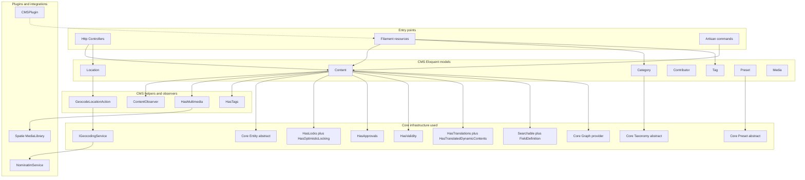
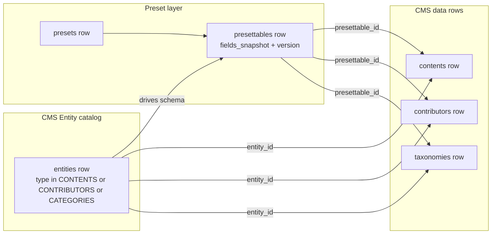
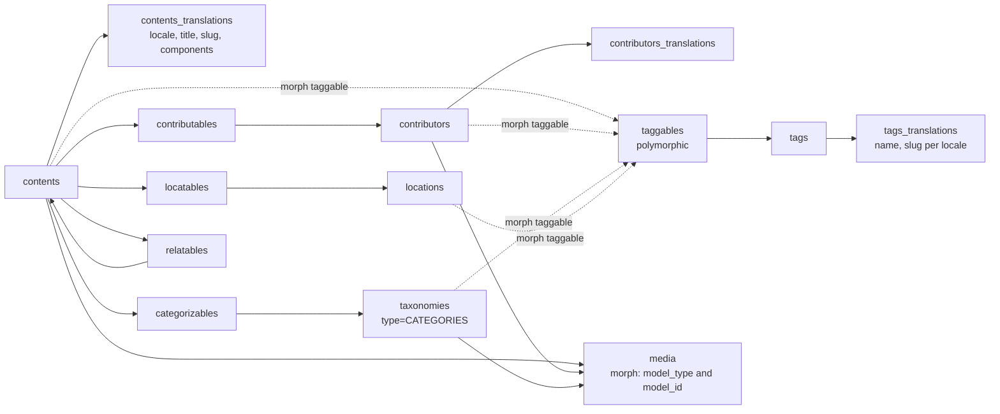
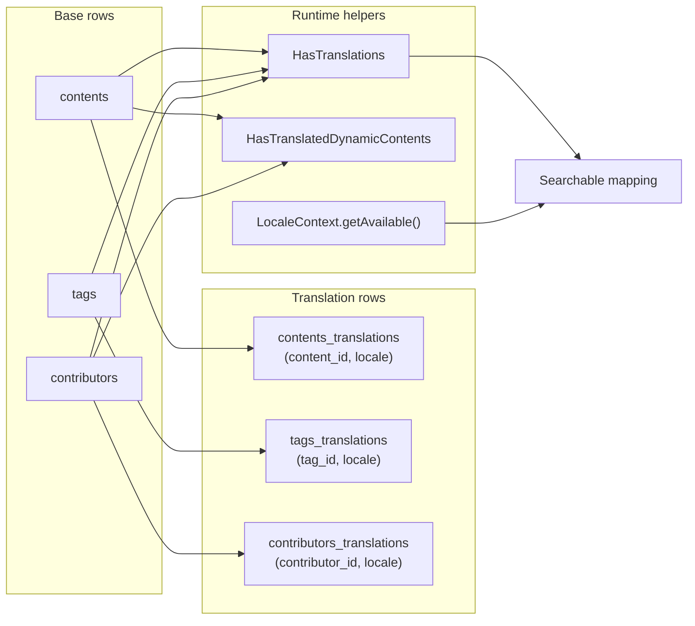
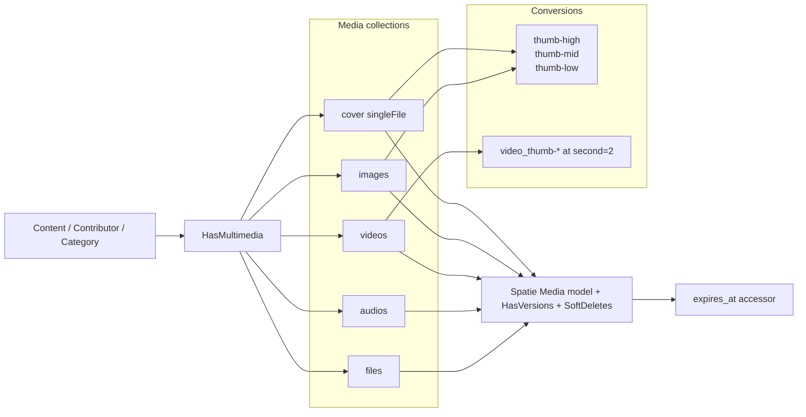
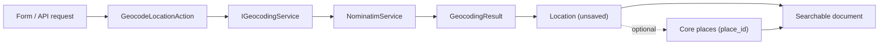
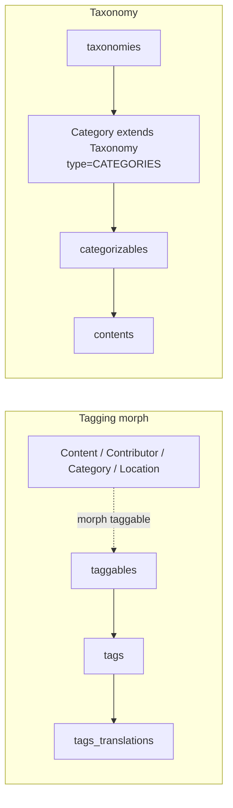
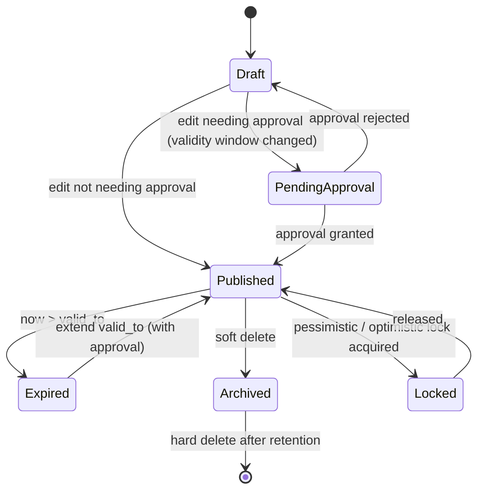
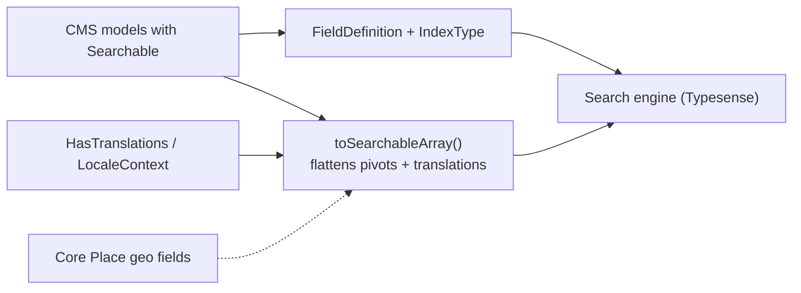

# CMS module — content domain and media workflows

## Purpose

`CMS` manages the content lifecycle for Laraplate installations: content entities, publication records, taxonomy, media, and location-aware metadata. It builds on top of `Core` for identity, lifecycle traits (locking/approvals/validity/translations), and dynamic entity/preset/translation primitives, layering CMS-specific models, observers, Filament resources, and geocoding integration.

### Module boundaries

HTTP/Filament/Artisan entry points talk to CMS Eloquent models (`Content`, `Tag`, `Category`, `Contributor`, `Location`, `Preset`, `Media`). Models extend Core abstractions (`Core\Models\Entity`, `Core\Models\Taxonomy`, `Core\Models\Preset`) and reuse Core traits (`HasLocks`, `HasApprovals`, `HasValidity`, `HasTranslations`, `HasTranslatedDynamicContents`, `HasPath`, `HasPlace`, `Searchable`). Side effects are orchestrated by the `ContentObserver` (auto-assignment of `entity_id` / `presettable_id`), the geocoding action `GeocodeLocationAction` over `IGeocodingService` (default `NominatimService`), the Spatie media library pipeline wired through the `HasMultimedia` helper, and `CmsGraphProvider` for Core Graph defaults. The `CMSPlugin` registers Filament resources for the panel.

## Main capabilities

### Dynamic content model: Entity, Preset, Presettable, Content

CMS sits on top of the Core dynamic-entity stack. `Modules/CMS/app/Models/Entity.php` extends `Core\Models\Entity` and exposes the `EntityType` enum with three CMS values: `CONTENTS`, `CONTRIBUTORS`, and `CATEGORIES`. Each `Entity` row drives schema and presets; a `Presettable` is a versioned snapshot of fields tied to one preset and one entity (table `presettables`). Domain rows (`Content`, `Contributor`, `Category`) carry both `entity_id` and `presettable_id`. The `ContentObserver` auto-assigns these on creation when missing; `Preset::migrateContentsToLastVersion()` reassigns existing rows to the latest snapshot when fields change.

#### Content relationships and morph pivots

`Content` is the editorial aggregate root for `EntityType::CONTENTS`. It links contributors, categories, locations, related contents, and tags via dedicated pivots: `contributables`, `categorizables` (FK on `taxonomy_id`), `locatables`, `relatables`, and the polymorphic `taggables` (used by `Content`, `Contributor`, `Category`, `Location` through `HasTags`). Translations live in `contents_translations` keyed by `content_id` + `locale` and store the user-facing fields `title`, `slug`, `components`. `Searchable` builds a Typesense schema that flattens contributors/categories/tags/locations and emits per-locale `title_{locale}` and `slug_{locale}` keys.

### Multilocale translations

Translations are first-class for `Content` (`contents_translations`), `Tag` (`tags_translations`), and `Contributor` (`contributors_translations`). The `HasTranslations` trait on the model exposes translatable fields (`title`/`slug`/`components` for content, `name`/`slug` for tags) and merges them into `toArray()` so callers see the active-locale view. `HasTranslatedDynamicContents` adds dynamic component schema and rules per locale on top. The `Searchable` mapping emits both default-locale fields and `title_{locale}` / `slug_{locale}` per available locale via `LocaleContext::getAvailable()`.

### Multimedia pipeline

The `HasMultimedia` helper wires Spatie MediaLibrary on `Content`, `Contributor`, and `Category`. It registers the standard collections `cover` (single file), `images`, `videos`, `audios`, `files`, and three image quality conversions (`thumb-high|mid|low`) plus matching video conversions extracting a frame at second 2. `cover` is exposed as an accessor returning the first media entry. The `Modules/CMS/app/Models/Media.php` model extends Spatie's base media adding `HasVersions` and `SoftDeletes`, and exposes an `expires_at` accessor that, while trashed, projects a future expiration timestamp using `core.soft_deletes_expiration_days`.

### Location and geocoding

`Location` extends `Core\Overrides\Model`, uses `HasPlace` to point to a canonical `places.id` row (Core), `HasSpatial` for geometry via `geolocation` Point, `HasSlug`, `HasPath`, and `HasTags`. Geocoding is an explicit action: `GeocodeLocationAction` injects `Core\Contracts\Geocoding\IGeocodingService`. The default binding is `NominatimService` (`Modules/CMS/app/Services/NominatimService.php`) which calls OpenStreetMap Nominatim and maps results into a partially-filled, **non-persisted** `Location`. The Searchable mapping prefers the canonical `Place` document fields when `place_id` resolves, otherwise emits a manual `geocode` array `[lat, lon]`.

### Tagging and taxonomy

Tags are polymorphic via the `taggables` morph pivot (`tag_id` + `taggable_id` + `taggable_type`) and translated through `tags_translations`. The `HasTags` trait offers `attachTag`, `detachTag`, `syncTags`, and the scopes `withAllTags`, `withAnyTags`, `withoutTags`, `withAllTagsOfAnyType`, `withAnyTagsOfAnyType`. Categories are CMS-specific taxonomies: `Category` extends `Core\Models\Taxonomy` with table `taxonomies`, sets `EntityType::CATEGORIES`, uses `HasMultimedia`, and connects to `Content` via the `categorizables` pivot keyed on `(content_id, taxonomy_id)`.

### Lifecycle: validity, approvals, locking

`Content` composes the cross-cutting Core lifecycle traits. `HasValidity` filters by `valid_from` / `valid_to` (the `valid()` global scope is added in `booted()`). `HasApprovals` requires explicit approval before persisting changes; `Content` overrides `requiresApprovalWhen()` so only validity-window edits demand approval. `HasLocks` and `HasOptimisticLocking` block concurrent edits and stale writes. `SortableTrait` sorts by `order_column` (renamed `scopeOrdered` to `scopePriorityOrdered` to avoid Searchable trait clashes). `Searchable` also indexes `valid_from`, `valid_to`, and `is_deleted` so the search layer reflects publication state.

### CMS graph provider

CMS is the first module provider for the Core Graph framework. It registers `CmsGraphProvider`, but Core owns `/crud/graph/expand`, `/crud/graph/search`, `/crud/graph/stats`, traversal, ACL filtering, provider rule enforcement, and response serialization. CMS contributes default content relations and presentation metadata only.

For `contents`, provider defaults expand `tags`, `categories`, `contributors`, and `locations` when the caller omits `relations[]`. Explicit `relations[]` still win. CMS summary fields include editorial identifiers (`title`, `slug`, `path`, `status`, `type`, timestamps), and edge labels map relation names to content semantics such as `tagged_as`, `categorized_as`, `contributed_by`, and `located_at`. Relations that expose implementation internals (`translations`, `history`, `modifications`, `locks`, `media`) are excluded from graph traversal.

### Search indexing

CMS models implementing `Searchable` build their Typesense schema declaratively through `FieldDefinition` + `IndexType`. `Content::getSearchMapping()` emits flattened arrays for contributors/categories/tags/locations, separate per-locale title/slug fields, and a vector `embedding` field. `Content::toSearchableArray()` reads translations through `HasTranslations`, hydrates pivot data, and projects `valid_from` / `valid_to` so filters can mirror the publishing window. `Location::getSearchMapping()` adds geo + address keyword fields and reuses Core `Place::searchDocumentGeographyFields()` when `place_id` is set.

### Filament module integration

CMS registers panel resources through `CMSPlugin` (`Modules/CMS/app/Filament/CMSPlugin.php`), which uses `Coolsam\Modules\Concerns\ModuleFilamentPlugin` to auto-discover module Filament classes. Resources cover `Contents`, `Categories`, `Tags`, `Contributors`, `Locations`, `Presets`, `Templates`, and `Entities`, plus shared utilities (`HasRecords`, `HasTable`) and the `CMSStatsWidget`.

## How to use

1. Define `Entity` rows for each domain (CONTENTS / CONTRIBUTORS / CATEGORIES) and seed presets for the structures you publish.
2. Create domain rows (`Content`, `Contributor`, `Category`) and let the observer auto-assign `entity_id` / `presettable_id` if you don't pass them explicitly.
3. Attach taxonomy/contributor/location/tag relations through the morph pivots; populate translations per locale through `HasTranslations`.
4. Use `GeocodeLocationAction` only when provider quotas/UA/contact info policies are aligned with `NominatimService` defaults.
5. Expose CMS outputs through API/theme routes following project conventions; the search layer can be queried as soon as Searchable indexes are populated.

## Internal flow (high-level)

- Resource form inputs are normalized and persisted through CMS Eloquent models with strong validation rules in `getRules()`.
- Media uploads route through `HasMultimedia` collections and run conversions (image and video keyframes) according to the configuration.
- Optional geocoding enriches `Location` rows; canonical geography lives on `Core places` when `place_id` is available.
- Search indexing is driven by `Searchable` schemas; pivots, translations, and validity dates flow into the search documents to mirror UX filters.
- CMS exposes indexed relation-field filters for content search. Supported dot paths include `contributors.id`, `contributors.slug`, `contributors.path`, `categories.id`, `categories.slug`, `categories.path`, `tags.id`, `tags.slug`, `tags.path`, `locations.id`, `locations.slug`, `locations.city`, `locations.province`, `locations.country`, `locations.postcode`, and `locations.zone`. Core translates them consistently across Elasticsearch, Typesense, and database search.
- CMS contributes Core Graph provider defaults for content relations; Graph remains a Core capability and CMS does not own traversal, route registration, or authorization behavior.

## Dependencies and boundaries

- Depends on `Core` for identity, permissions, lifecycle traits, dynamic entities/presets/translations, and shared CRUD infrastructure.
- Should not duplicate cross-cutting capabilities already provided by `Core` (approvals, locking, versioning, ACL mechanics).
- `Tag` and `Media` are CMS-owned but conceptually cross-cutting: see the embryonic `ecommerce` plan for the long-term ownership decision (`Product` as anchor with FKs to `Content` and ERP `Item`, no duplication of fields).

## Common pitfalls

- Migrating legacy content without first aligning `Entity`/`Presettable` causes inconsistent structures and search-mapping drift.
- Treating CMS as a plain WYSIWYG underuses the dynamic schema, translations, and approvals already in place.
- Skipping `Preset::migrateContentsToLastVersion()` after schema changes leaves rows tied to outdated `presettable.version`.
- Querying tags by `name` directly skips translations: use `Tag::findFromString()` / scopes that JOIN `tags_translations`.
- Calling Nominatim without the User-Agent or above its rate limits is a fast way to get blocked.

## FAQ prompts for RAG

- Which content features are still owned by CMS versus moved to Core?
- How do `Entity`, `Preset`, and `Presettable` interact when I add a new content type?
- How is locale resolved for `Content`, `Tag`, and `Contributor` translations?
- How should taxonomy be modeled for multi-locale content?
- When should CMS media processing run through queues?
- What is the safest migration path for legacy CMS data imports?
- How does CMS contribute to the Searchable Typesense schema for content?
- How is geocoding wired and how do I plug in an alternative provider?
